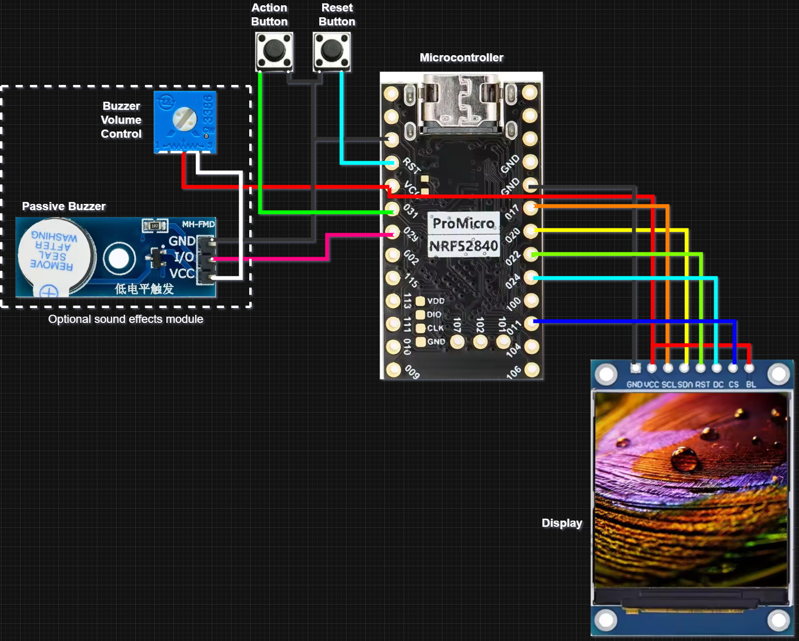

This custom **ZMK Sofle** configuration is a high-performance, dongle-based split keyboard setup. It features a unique **Central Dongle** that offloads processing to a dedicated nice!nano (reducing latency and saving battery on the halves) and integrates a specialized **Snake Game** module with custom animations and audio.

---

# 🐍 ZMK Sofle "Snake" Edition


A highly customized ZMK firmware for the Sofle keyboard, utilizing a **dedicated dongle** (central role) and two wireless peripherals (left/right halves).

## ✨ Key Features

* **Dongle-Central Architecture:** Processing is handled by a standalone nice!nano dongle to improve battery life on the keyboard halves.
* **Snake Game Integration:** Includes the `snake-module` for custom display animations and gameplay.
* **Enhanced Connectivity:** Boosted Bluetooth TX power ( dBm) for a rock-solid wireless link.
* **Custom OLED Visuals:** Features custom status screens, WPM tracking, and battery level fetching for all connected peripherals.
* **Rotary Encoder Support:** Fully configured for dual EC11 encoders on the keyboard halves.

## 🛠 Hardware Configuration

* **Controller:** nice!nano v2.0.0.
* **Keyboard:** Sofle (Split 60%).
* **Displays:** SSD1306 OLED (128x32) on halves; ST7789V on Dongle.
* **Additional Hardware:** Buzzer support for UI sounds.

---

### Product & Wiring Images

- **Product Image**

	

- **Wiring Diagram**

	

## ⌨️ Default Keymap Layers

| Layer | Function | Key Features |
| --- | --- | --- |
| **0: BASE** | Standard Typing | QWERTY, Volume Control (Encoder) |
|**1: LOWER** | Numbers/Symbols | F-keys, Punctuation, Page Nav (Encoder)  |
| **2: RAISE** | Navigation/BT | Bluetooth profile selection, Arrow keys  |
| **3: ADJUST** | System/RGB | RGB Toggle, Underglow effects, Ext Power  |

> 
> **Note:** The **ADJUST** layer is automatically triggered by holding both **LOWER** and **RAISE** keys simultaneously.
> 
> 

---

```

---

## 📝 Customization

* **Keyboard Name:** Set to **"Snake"**.
* **Sleep:** Deep sleep is enabled to conserve power.
* **Dongle Settings:** Configured to handle 2 peripherals with a maximum of 5 Bluetooth connections.
