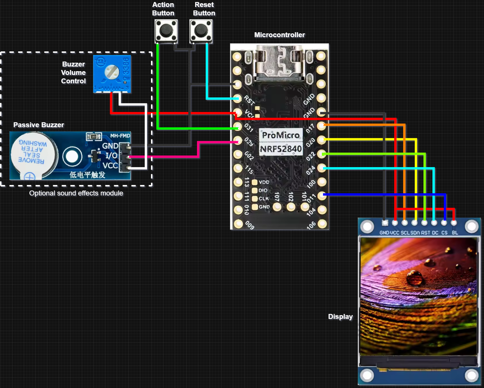

# Snake Sofle ZMK

<p align="center">
  
  
  
</p>

<p align="center">
  <a href="https://github.com/vaibhav8600-rgb/zmk-sofle-main/actions/workflows/build.yml"></a>
  
  
  
</p>

<p align="center">
  A custom dongle-central Sofle firmware named <strong>Snake</strong>, built on ZMK with two wireless halves, a dedicated nice!nano central dongle, a themed ST7789 display experience, pointer controls, encoder support, Windows workflow shortcuts, and an integrated snake game module.
</p>

---

## Table Of Contents

- [What Makes This Build Special](#what-makes-this-build-special)
- [System Architecture](#system-architecture)
- [Build Artifacts](#build-artifacts)
- [Hardware Profile](#hardware-profile)
- [Keymap](#keymap)
- [Snake Layer](#snake-layer)
- [Snake And Display Experience](#snake-and-display-experience)
- [Flashing Guide](#flashing-guide)
- [Pairing And Reset Flow](#pairing-and-reset-flow)
- [Repository Map](#repository-map)
- [Customization Guide](#customization-guide)
- [Troubleshooting](#troubleshooting)
- [Wiring Reference](#wiring-reference)

---

## What Makes This Build Special

- Dedicated dongle-central split BLE topology using `central_dongle`.
- Separate firmware artifacts for dongle, left half, right half, and settings reset.
- Four real layers only: `BASE`, `LOWER`, `RAISE`, and `NAV_SNAKE`.
- No `ADJUST` layer is defined in this keymap.
- `NAV_SNAKE` is a real playable snake control layer, not a placeholder.
- Dongle-side ST7789V snake/status UI with custom splash art, colors, sounds, WPM, layer, connectivity, modifiers, and battery data.
- Both peripherals use nice!view e-paper displays through `nice_view_adapter nice_view_gem`.
- EC11 encoders, pointer movement, mouse buttons, scrolling, output switching, Bluetooth profile controls, combos, and Windows workflow shortcuts.
- Anti-idle mouse jiggler: toggle humanized cursor micro-movements from the snake layer to keep the host awake, with a green status dot on the dongle display.
- Deep sleep, boosted BLE TX power, and central battery fetching are enabled.

---

## System Architecture

```text
                     USB / BLE host
                          |
                          v
                nice!nano central dongle
              shield: central_dongle snake_adapter
              display: ST7789V + custom snake/status UI
                    /                         \
                   / BLE split links           \
                  v                             v
      left Sofle peripheral              right Sofle peripheral
      shield: sofle_left_peripheral      shield: sofle_right
      display: nice!view e-paper         display: nice!view e-paper
      encoder: left EC11                 encoder: right EC11
```

Why this layout matters:

- The dongle handles the central split role, host connection, display logic, snake module UI, and battery fetching for both peripherals.
- The keyboard halves stay focused on scanning keys, encoders, and split BLE communication.
- The build produces independent firmware images so each physical device gets exactly the shield stack it needs.

---

## Build Artifacts

The firmware matrix is defined in [`build.yaml`](build.yaml).

```text
snake_dongle
  Board:  nice_nano@2.0.0//zmk
  Shield: central_dongle snake_adapter
  Flash:  dedicated nice!nano dongle

sofle_left_peripheral
  Board:  nice_nano@2.0.0//zmk
  Shield: sofle_left_peripheral nice_view_adapter nice_view_gem
  Flash:  left Sofle half

sofle_right
  Board:  nice_nano@2.0.0//zmk
  Shield: sofle_right nice_view_adapter nice_view_gem
  Flash:  right Sofle half

settings_reset
  Board:  nice_nano@2.0.0//zmk
  Shield: settings_reset
  Flash:  any controller that needs BLE/settings reset
```

The workflow in [`.github/workflows/build.yml`](.github/workflows/build.yml) runs ZMK's reusable user-config build on pushes, pull requests, and manual dispatch.

---

## Hardware Profile

```text
Keyboard:       Sofle split keyboard layout
Controllers:    nice!nano v2.0.0 for dongle and halves
Dongle display: ST7789V color display, rotated 90 degrees
Half displays:  nice!view e-paper via nice-view-gem
Encoders:       dual EC11 support
Matrix:         5 rows, 12 logical full-layout columns, col2row diodes
Underglow:      WS2812 SPI overlay provision, 10 LED chain length
Buzzer:         enabled for snake/menu/status/splash/food/death/theme sounds
```

Important hardware files:

- [`config/boards/shields/sofle/sofle.dtsi`](config/boards/shields/sofle/sofle.dtsi) defines the shared matrix, transform, display-compatible node, sensors, and encoder nodes.
- [`config/boards/shields/sofle/sofle_left_peripheral.overlay`](config/boards/shields/sofle/sofle_left_peripheral.overlay) enables the left-side columns and left encoder.
- [`config/boards/shields/sofle/sofle_right.overlay`](config/boards/shields/sofle/sofle_right.overlay) applies the right-side column offset and enables the right encoder.
- [`config/boards/shields/sofle/central_dongle.overlay`](config/boards/shields/sofle/central_dongle.overlay) gives the dongle a mock kscan and shared transform for central behavior.

---

## Keymap

The active keymap lives in [`config/sofle.keymap`](config/sofle.keymap). The shield-level keymap includes that file so the same layout is used by the custom shield.

### Layer Overview

This firmware has exactly these layers:

```text
0 BASE       Typing, Windows shortcuts, Teams mute, app macro
1 LOWER      Numbers, symbols, function keys
2 RAISE      Bluetooth, output switching, arrows, pointer controls
3 NAV_SNAKE  Snake game controls, anti-idle toggle, dongle action
```

There is no `ADJUST` layer in [`config/sofle.keymap`](config/sofle.keymap). Holding `LOWER` and `RAISE` together activates `NAV_SNAKE`, because the conditional layer is configured this way:

```text
if-layers = <LOWER RAISE>
then-layer = <NAV_SNAKE>
```

### Base Layer Highlights

- Windows app launch: number-row keys use `LG(N1)` through `LG(N5)` as mod-taps.
- Multi app macro: `multi_win_apps` taps `Win+1` through `Win+5`.
- Clipboard helpers: `Z`, `X`, `C`, and `V` use Ctrl mod-tap behavior.
- Teams mic mute: `LC(LS(M))` appears on the base layer.
- Tap-dance layers: `LOWER` and `RAISE` can be momentary on hold or toggled by double tap.
- Encoder behavior: one encoder handles volume, the other handles vertical scroll.

### Combos

| Combo | Layer | Result |
| --- | --- | --- |
| `J + K + L` | `BASE` | `Enter` |
| `A + S + D` | `BASE` | `Ctrl+A` |
| `4 + 5` | `BASE` and `NAV_SNAKE` | Toggle snake layer |

### Pointer Controls

Pointer support is enabled with `CONFIG_ZMK_POINTING=y`.

| Raise binding area | Action |
| --- | --- |
| Left click / right click / middle click | Mouse button actions |
| Move up/down/left/right | Cursor movement |
| Encoder scroll binding | Scroll up/down via `inc_dec_msc` |

Mouse feel tuning:

- Move ramp: `time-to-max-speed-ms = 220`
- Scroll ramp: `time-to-max-speed-ms = 200`
- Scroll acceleration exponent: `0` for a linear feel

---

## Snake Layer

The snake layer is defined as `NAV_SNAKE` / layer `3` in [`config/sofle.keymap`](config/sofle.keymap). Its display name is `snake`.

### How To Enter Snake Layer

- Hold `LOWER` and `RAISE` together.
- Or press the `4 + 5` combo on the left number row to toggle snake mode.
- Press `4 + 5` again while in snake mode to toggle it off.

### What Snake Layer Does

Most keys are intentionally disabled with `&none` so typing keys do not interfere with the game. Only the snake controls, dongle action key, anti-idle toggle, and a couple of layer toggles remain active.

```text
Right half controls while NAV_SNAKE is active

Top row:                         far-right key = dongle action
Home-row cluster:                I / J / K / L = snake directions
Thumbs:                          Lower and Raise toggles remain available

Left half: A = anti-idle (mouse jiggler) toggle
```

### Anti-Idle (Mouse Jiggler)

Press `A` while in the snake layer to toggle anti-idle on or off. While on, the dongle sends humanized mouse micro-movements (random bursts of ±1–2 px moves with random 20–60 s pauses) so the host never goes idle, locks, or sleeps.

- Toggle on: the cursor gives a small twitch ~300 ms later as confirmation.
- Status: a bright green dot appears in the top-right of the dongle status screen while active.
- It keeps running after you leave the snake layer — return and press `A` again to stop.
- Implemented by `&anti_idle` (`zmk,behavior-anti-idle`) from the snake module; only the dongle sends the movements, so the halves' battery life is unaffected.

### Direction Keys

The display is rotated, so the keymap compensates for the snake module direction numbers.

```text
I = visual Up
J = visual Left
K = visual Down
L = visual Right
```

Actual ZMK bindings:

```text
I -> &snake_dir 1
J -> &snake_dir 2
K -> &snake_dir 3
L -> &snake_dir 0
```

The top-right key on the snake layer calls `&dongle_action_behavior`, which is meant for dongle-side snake/menu action behavior from the snake adapter.

---

## Snake And Display Experience

The dongle config in [`config/boards/shields/sofle/central_dongle.conf`](config/boards/shields/sofle/central_dongle.conf) is the visual and game control center.

### Enabled Display Features

```text
Display:          CONFIG_ZMK_DISPLAY=y
Controller:       ST7789V, RGB565
Rotation:         CONFIG_ROTATE_DISPLAY=90
Splash:           config/custom_splash.c
Splash time:      6000 ms
Default screen:   status
Info slot mode:   4-slot
Visible slots:    empty, theme, connectivity, layer
Battery fetching: central fetches both peripheral battery levels
WPM thresholds:   20 / 40 / 80 / 90
```

### Snake Module Settings

```text
Board size:        L
Snake fatness:     1
Walk interval:     20 ms
Checkered board:   enabled
Theme threshold:   300 ms
Mute threshold:    600 ms
Logo interval:     40 ms
```

### Sound Settings

The dongle enables buzzer support and sound feedback for splash, food, die, theme, menu, and status events.

```text
CONFIG_USE_BUZZER=y
CONFIG_USE_SPLASH_SOUND=y
CONFIG_USE_FOOD_SOUND=y
CONFIG_USE_DIE_SOUND=y
CONFIG_USE_THEME_SOUND=y
CONFIG_USE_MENU_SOUND=y
CONFIG_USE_STATUS_SOUND=y
```

---

## Flashing Guide

### Option 1: GitHub Actions

1. Push your changes to GitHub.
2. Open the repository Actions tab.
3. Run or wait for the `build.yml` workflow.
4. Download the firmware artifacts.
5. Flash each UF2 to the matching controller:
   - `snake_dongle` to the dedicated dongle nice!nano.
   - `sofle_left_peripheral` to the left half.
   - `sofle_right` to the right half.

### Option 2: Local ZMK Build

Use this if your ZMK workspace is already set up locally.

```powershell
west update
west build -s zmk/app -d build/snake_dongle -b "nice_nano@2.0.0//zmk" -- -DSHIELD="central_dongle snake_adapter" -DZMK_CONFIG="$PWD/config"
west build -s zmk/app -d build/sofle_left -b "nice_nano@2.0.0//zmk" -- -DSHIELD="sofle_left_peripheral nice_view_adapter nice_view_gem" -DZMK_CONFIG="$PWD/config"
west build -s zmk/app -d build/sofle_right -b "nice_nano@2.0.0//zmk" -- -DSHIELD="sofle_right nice_view_adapter nice_view_gem" -DZMK_CONFIG="$PWD/config"
```

The project manifest is [`config/west.yml`](config/west.yml). It tracks:

```text
ZMK:            zmkfirmware/zmk, revision main
Snake module:   vaibhav8600-rgb/snake-module, revision improvements
nice-view-gem:  M165437/nice-view-gem, revision main
```

---

## Pairing And Reset Flow

For a clean bring-up:

1. Flash `settings_reset` to the dongle and both halves if they have stale pairings.
2. Flash `snake_dongle` to the dongle.
3. Flash `sofle_left_peripheral` to the left half.
4. Flash `sofle_right` to the right half.
5. Power the dongle first, then power the halves.
6. Use the Raise layer Bluetooth controls to select or clear host profiles.

Useful Raise layer controls:

| Binding | Purpose |
| --- | --- |
| `BT_SEL 0` to `BT_SEL 4` | Select host profile 1-5 |
| `BT_CLR` | Clear current profile |
| `BT_CLR_ALL` | Clear all stored profiles |
| `OUT_USB` | Force USB output |
| `OUT_BLE` | Force BLE output |
| `OUT_TOG` | Toggle output |

---

## Repository Map

```text
.
|-- README.md
|-- build.yaml
|-- .github/workflows/build.yml
|-- images/
|   |-- 1770889269846.jfif
|   |-- 1770889270673.jfif
|   |-- produuct img.jpeg
|   `-- wiring.webp
`-- config/
    |-- west.yml
    |-- sofle.conf
    |-- sofle.keymap
    |-- info.json
    |-- custom_splash.c
    `-- boards/shields/sofle/
        |-- central_dongle.conf
        |-- central_dongle.overlay
        |-- sofle.dtsi
        |-- sofle_left_peripheral.overlay
        |-- sofle_right.overlay
        |-- sofle.keymap
        |-- sofle.zmk.yml
        |-- Kconfig.defconfig
        |-- Kconfig.shield
        `-- boards/nice_nano.overlay
```

---

## Customization Guide

- Change keys, layers, combos, macros:
  [`config/sofle.keymap`](config/sofle.keymap), look for `keymap`, `combos`, `macros`, and `behaviors`.
- Rename keyboard:
  [`config/sofle.conf`](config/sofle.conf) and [`central_dongle.conf`](config/boards/shields/sofle/central_dongle.conf), look for `CONFIG_ZMK_KEYBOARD_NAME`.
- Tune snake gameplay:
  [`central_dongle.conf`](config/boards/shields/sofle/central_dongle.conf), look for `CONFIG_SNAKE_*`.
- Change display theme:
  [`central_dongle.conf`](config/boards/shields/sofle/central_dongle.conf), look for `CONFIG_*_COLOR`.
- Change splash art:
  [`config/custom_splash.c`](config/custom_splash.c), look for `custom_splash_map`, width, and height.
- Adjust display slots:
  [`central_dongle.conf`](config/boards/shields/sofle/central_dongle.conf), look for `CONFIG_INFO_SLOT_*`.
- Tune pointer movement:
  [`config/sofle.keymap`](config/sofle.keymap), look for `&mmv` and `&msc`.
- Tune encoders:
  [`config/sofle.keymap`](config/sofle.keymap) and [`sofle.dtsi`](config/boards/shields/sofle/sofle.dtsi), look for `sensor-bindings`, `triggers-per-rotation`, and `steps`.
- Change build outputs:
  [`build.yaml`](build.yaml), look for the `include` matrix.
- Update module revisions:
  [`config/west.yml`](config/west.yml), look for `projects`.

---

## Troubleshooting

- Halves do not connect to dongle:
  flash `settings_reset` to all controllers, then reflash dongle first and halves second.
- Wrong half sends wrong columns:
  confirm the left half uses `sofle_left_peripheral` and the right half uses `sofle_right`.
- Bluetooth host will not pair:
  use Raise layer `BT_CLR` or `BT_CLR_ALL`, then pair again from the host.
- Display is rotated incorrectly:
  check `CONFIG_ROTATE_DISPLAY=90` in `central_dongle.conf`.
- Snake controls feel rotated:
  this is expected because the keymap compensates for the 90-degree display orientation.
- Encoders do nothing:
  confirm the correct half firmware is flashed and EC11 support is enabled in `config/sofle.conf`.
- Mouse keys do nothing:
  confirm `CONFIG_ZMK_POINTING=y` remains enabled.
- Anti-idle does not move the cursor:
  confirm `CONFIG_ZMK_POINTING=y` is enabled for the dongle build and that the green indicator square is showing on the dongle status screen (press `A` in the snake layer to toggle).
- Build cannot find snake symbols:
  confirm `snake-module` is present from `config/west.yml` and the dongle shield stack includes `snake_adapter`.

---

## Wiring Reference

<p align="center">
  
</p>

---

## Credits

This configuration builds on:

- [ZMK Firmware](https://github.com/zmkfirmware/zmk)
- [Sofle Keyboard](https://github.com/josefadamcik/SofleKeyboard)
- [`nice-view-gem`](https://github.com/M165437/nice-view-gem)
- [joaopedropio](https://github.com/joaopedropio), who created the initial dongle foundation used as the base for this project.
- [vaibhav8600-rgb/snake-module](https://github.com/vaibhav8600-rgb/snake-module), enhanced here with multiple features including playable snake gameplay on the dongle, custom splash screen support, display theming, sounds, and status/game UI improvements.
- [felixJR123](https://github.com/felixJR123), credited for the 3D-print case design.
