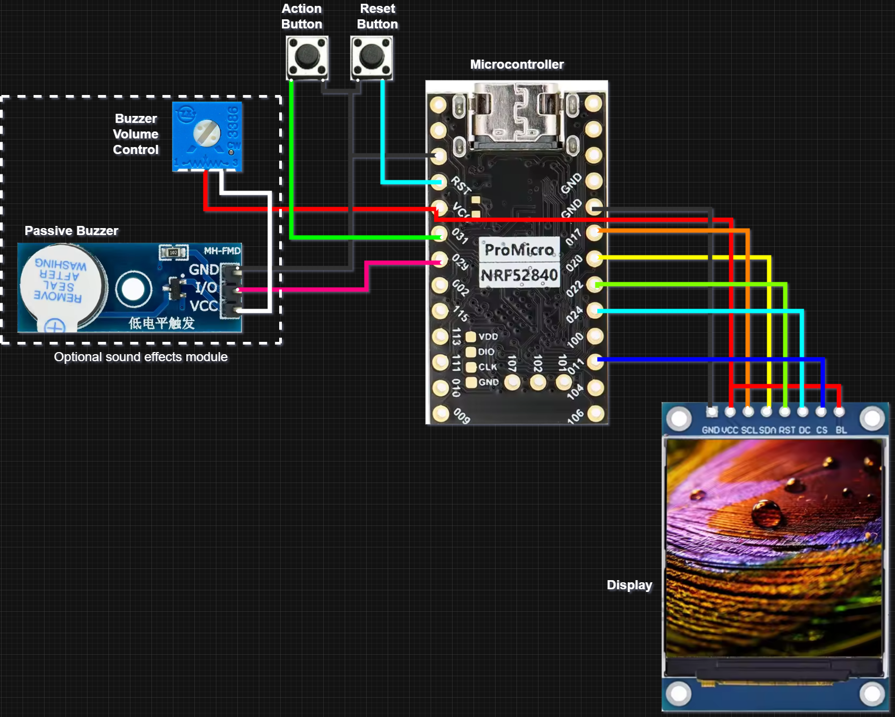

# Snake Sofle ZMK

<p align="center">
  
  
  
</p>

<p align="center">
  <a href="https://github.com/vaibhav8600-rgb/zmk-sofle-main/actions/workflows/build.yml"></a>
  
  
  
</p>

<p align="center">
  A dongle-central Sofle on ZMK: two wireless halves with nice!view displays, and a nice!nano dongle with a colour ST7789 screen that runs one of two firmwares - <strong>NEXUS</strong>, a smart dongle with a dashboard, games, a PC companion, ZMK Studio and phone control, or the original <strong>Snake</strong> dongle.
</p>

---

## Table Of Contents

- [Two Dongle Firmwares](#two-dongle-firmwares)
- [System Architecture](#system-architecture)
- [Build Artifacts](#build-artifacts)
- [Hardware Profile](#hardware-profile)
- [Keymap](#keymap)
- [GAME Layer](#game-layer)
- [NEXUS Dongle](#nexus-dongle)
- [Snake Dongle](#snake-dongle)
- [Flashing Guide](#flashing-guide)
- [Pairing And Reset Flow](#pairing-and-reset-flow)
- [Repository Map](#repository-map)
- [Customization Guide](#customization-guide)
- [Troubleshooting](#troubleshooting)
- [Wiring Reference](#wiring-reference)
- [Credits](#credits)

---

## Two Dongle Firmwares

The same dongle hardware runs either firmware. Flash **one** of them; the halves are the same for both.

| | `nexus_dongle` (recommended) | `snake_dongle` |
| --- | --- | --- |
| Module | [nexus](https://github.com/vaibhav8600-rgb/nexus) | [snake-module](https://github.com/vaibhav8600-rgb/snake-module) |
| Screen | Dashboard: links, layer, modifiers, WPM, both batteries | Snake game and status slots |
| Games | Tetris, Snake, Breakout, Pac-Man, Jumper, Invaders, Pong, from a Game Center | Snake |
| Controls | Dongle button plus the GAME layer | Dongle screen and menu (no keyboard steering in this keymap) |
| Extras | Themes, custom splash, HOST screen (PC clock and stats), ZMK Studio over USB, phone remote | Splash art, themes, sounds |
| Bluetooth name | `NEXUS` | `Snake` |

<p align="center">
  
  
  
  
</p>

Both builds share the anti-idle mouse jiggler, deep sleep on the halves, boosted BLE TX power and central battery fetching.

---

## System Architecture

```text
                     USB / BLE host
                          |
                          v
                nice!nano central dongle
      shield: central_dongle nexus_dongle   (or central_dongle snake_adapter)
      display: ST7789V 240x240
                    /                         \
                   / BLE split links           \
                  v                             v
      left Sofle peripheral              right Sofle peripheral
      shield: sofle_left_peripheral      shield: sofle_right
      display: nice!view e-paper         display: nice!view e-paper
      encoder: left EC11                 encoder: right EC11

      phone (NEXUS Remote app) --BLE--> dongle      NEXUS only
```

- The dongle is the split central: it talks to the host over USB or BLE, runs the display, and fetches both halves' batteries.
- The halves only scan keys and encoders and send them to the dongle.
- With NEXUS and Remote Input, a phone also connects to the dongle and its input goes out through the same USB keyboard and mouse.

---

## Build Artifacts

The firmware matrix is defined in [`build.yaml`](build.yaml).

```text
nexus_dongle
  Board:   nice_nano@2.0.0//zmk
  Shield:  central_dongle nexus_dongle
  Snippet: studio-rpc-usb-uart      (ZMK Studio over USB)
  Flash:   the dongle - OR snake_dongle, never both

snake_dongle
  Board:   nice_nano@2.0.0//zmk
  Shield:  central_dongle snake_adapter
  Flash:   the dongle - OR nexus_dongle

sofle_left_peripheral
  Board:   nice_nano@2.0.0//zmk
  Shield:  sofle_left_peripheral nice_view_adapter nice_view_gem
  Flash:   left Sofle half

sofle_right
  Board:   nice_nano@2.0.0//zmk
  Shield:  sofle_right nice_view_adapter nice_view_gem
  Flash:   right Sofle half

settings_reset
  Board:   nice_nano@2.0.0//zmk
  Shield:  settings_reset
  Flash:   any controller that needs its BLE pairings and settings wiped
```

The halves and `settings_reset` compile no NEXUS code: the NEXUS module only builds when the `nexus_dongle` shield is in the stack.

The workflow in [`.github/workflows/build.yml`](.github/workflows/build.yml) runs ZMK's reusable user-config build on pushes, pull requests and manual dispatch.

---

## Hardware Profile

```text
Keyboard:       Sofle split keyboard layout
Controllers:    nice!nano v2.0.0 for dongle and halves
Dongle display: ST7789V 240x240 colour, mounted upside down
                (NEXUS turns it 180 in software; Snake rotates 90)
Dongle extras:  passive buzzer (P0.29), action button (NEXUS)
Half displays:  nice!view e-paper via nice-view-gem
Encoders:       dual EC11
Matrix:         5 rows, 12 logical full-layout columns, col2row diodes
Underglow:      WS2812 SPI overlay provision, 10 LED chain length
```

Important hardware files:

- [`config/boards/shields/sofle/sofle.dtsi`](config/boards/shields/sofle/sofle.dtsi): shared matrix, transform, sensors and encoders.
- [`config/boards/shields/sofle/sofle_left_peripheral.overlay`](config/boards/shields/sofle/sofle_left_peripheral.overlay) and [`sofle_right.overlay`](config/boards/shields/sofle/sofle_right.overlay): each half's columns and encoder.
- [`config/boards/shields/sofle/central_dongle.overlay`](config/boards/shields/sofle/central_dongle.overlay): the dongle's mock kscan and shared transform.
- [`config/nexus_dongle.overlay`](config/nexus_dongle.overlay): NEXUS only - the physical layout ZMK Studio needs, and the second USB serial port for the HOST screen.

---

## Keymap

The keymap lives in [`config/sofle.keymap`](config/sofle.keymap) and is shared by every build.

```text
0 BASE    Typing, Windows shortcuts, Teams mute, app macro
1 LOWER   Numbers, symbols, function keys
2 RAISE   Bluetooth, output switching, arrows, pointer controls
3 GAME    The dongle's controls (NEXUS), anti-idle
```

There is no `ADJUST` layer. Holding `LOWER` and `RAISE` together turns on `GAME` (a conditional layer), and the `4 + 5` combo latches it.

### Base Layer Highlights

- Windows app launch: number-row keys `1`-`5` are `Win+1`..`Win+5` on hold.
- Multi app macro: `multi_win_apps` taps `Win+1` through `Win+5`.
- Clipboard helpers: `Z`, `X`, `C` and `V` are Ctrl on hold.
- Teams mic mute: `Ctrl+Shift+M` on the base layer.
- Tap-dance layers: `LOWER` and `RAISE` are momentary on hold, toggled on double tap.
- Encoders: left is volume, right is vertical scroll.

### Combos

| Combo | Layer | Result |
| --- | --- | --- |
| `J + K + L` | `BASE` | `Enter` |
| `A + S + D` | `BASE` | `Ctrl+A` |
| `4 + 5` | `BASE` and `GAME` | Toggle the GAME layer |

### Pointer Controls

Pointer support is enabled with `CONFIG_ZMK_POINTING=y`. RAISE has left, right and middle click and cursor movement; the right encoder scrolls.

- Move ramp: `time-to-max-speed-ms = 220`
- Scroll ramp: `time-to-max-speed-ms = 200`, linear (`acceleration-exponent = 0`)

---

## GAME Layer

### On NEXUS

The NEXUS build replaces the whole layer (the `#ifdef NEXUS_DONGLE` block at the bottom of the keymap). The left hand drives the dongle's screens, the right hand plays.

```text
 LEFT = dongle UI                                RIGHT = the game
 ,-------------------------------------.         ,-------------------------------------.
 |Unlock| MENU | SAVE | HOST |   |     |         |   |   |      |   |   | PAUSE        |
 | BACK | HOME | GAMES|  UP  |   |     |         |   |   |ROTATE|   |   |              |
 |      |AntiI |      | DOWN |ENTER|   |         |   |LEFT| DOWN |RIGHT|  |              |
 `-------------------------------------'         `-------------------------------------'
                 | Lower | ENTER |                 | DROP | Raise |
```

| Key | Action |
| --- | --- |
| `` ` `` | ZMK Studio unlock |
| `1` / `2` / `3` | Settings menu / save settings now / HOST screen |
| `Esc` / `Q` / `W` | Back / home dashboard / Game Center |
| `E` / `D` / `F` | Up / down / enter (pick a row, or pause a game) |
| `A` | Anti-idle on/off |
| `I` / `J` `K` `L` | Rotate / left, soft drop, right |
| `Del` | Pause, resume, restart, by context |
| Left thumb `Enter` / right thumb `Space` | Enter / hard drop |
| Left encoder / right encoder | Cycle the theme / volume |

Everything else on the layer is `&none`, so nothing types into the host while you play.

### On other builds

Any firmware built without the NEXUS shield gets the fallback layer: `&none` everywhere except `A` (anti-idle) and the layer toggles on the thumbs. The Snake steering bindings (`&snake_dir`, `&dongle_action_behavior`) are no longer in this keymap - the Snake dongle's keyboard controls live on its own branch.

### Anti-Idle (Mouse Jiggler)

Press `A` on the GAME layer to toggle anti-idle. While on, the dongle sends humanized mouse micro-movements (bursts of ±1-2 px with random 20-60 s pauses) so the host never idles, locks or sleeps.

- On: the cursor twitches once about 300 ms later as confirmation.
- Status: a dot on the dongle screen while active (NEXUS shows it in the corner of the dashboard).
- It keeps running after you leave the layer; press `A` again to stop.
- Only the dongle sends the movements, so the halves' batteries are unaffected.

---

## NEXUS Dongle

Settings live in [`config/nexus_dongle.conf`](config/nexus_dongle.conf), applied on top of the shared `central_dongle.conf` and only to the NEXUS build. Full documentation: the [NEXUS repository](https://github.com/vaibhav8600-rgb/nexus) and its [`docs/`](https://github.com/vaibhav8600-rgb/nexus/tree/main/docs).

### What this build turns on

```text
Name / brand:     NEXUS, "VAIBHAV TECH", "SMART ZMK DONGLE"
Theme:            NEXUS (seven to choose from), animations on
Display:          180 rotation; blanks 30 s + 870 s after the last key -
                  15 minutes, the same moment the halves go to sleep
Splash:           config/nexus/splash/splash.png, 240x240, 3.5 s
Sound:            UI, game and startup sounds; split-half connect chirps
Games:            all seven, high scores saved
Button:           30 ms debounce, 600 ms long press
Anti-idle dot:    on (from snake-module's &anti_idle)
ZMK Studio:       on, over USB only (no BLE transport)
HOST screen:      on (second USB serial port); goes stale after 5 s silent
BLE link:         latency 0, 8 s supervision timeout - a plugged-in dongle
Remote Input:     on; BT_MAX_CONN=8, BT_MAX_PAIRED=9 for the phones
```

### Phone remote (Remote Input)

Use a phone as keyboard, trackpad, media remote and NEXUS controller - nothing installed on the computer, which just sees the same USB keyboard and mouse.

1. On the dongle: **Settings > PHONE** opens a 60-second pairing window.
2. Open the app - [nexus-remote-seven.vercel.app](https://nexus-remote-seven.vercel.app) - in **Bluefy** on iPhone (Safari has no Web Bluetooth) or Chrome on Android, and tap **Connect to NEXUS**.
3. Type the six digits the dongle shows.

After that, **Connect to NEXUS** brings the phone back with no code - also while a laptop is connected over BLE. Android pairing is still experimental. Details: [Remote Input](https://github.com/vaibhav8600-rgb/nexus/blob/main/docs/remote-input.md); app source: [nexus-remote](https://github.com/vaibhav8600-rgb/nexus-remote).

### HOST screen

A small companion on the PC sends the time, CPU and RAM load and what is playing over the dongle's second USB serial port. The dongle has no clock of its own, so this is also how the time gets onto the dashboard. Install it from the NEXUS repo's [`tools/nexus-host`](https://github.com/vaibhav8600-rgb/nexus/tree/main/tools/nexus-host) (`install.cmd` on Windows).

### ZMK Studio

Plug the dongle in over USB, open [ZMK Studio](https://zmk.studio), and press `` ` `` on the GAME layer to unlock.

---

## Snake Dongle

The original firmware, built from [snake-module](https://github.com/vaibhav8600-rgb/snake-module). Its settings are in [`config/boards/shields/sofle/central_dongle.conf`](config/boards/shields/sofle/central_dongle.conf), which the NEXUS build also reads for the shared hardware (BLE, split, display bus) and then overrides.

```text
Display:          CONFIG_ZMK_DISPLAY=y, ST7789V RGB565, rotated 90
Splash:           config/custom_splash.c, 6000 ms
Default screen:   status, 4-slot info (theme, connectivity, layer)
Battery fetching: central fetches both halves
WPM thresholds:   20 / 40 / 80 / 90
Snake:            board L, fatness 1, 20 ms walk, checkered board
Sounds:           splash, food, die, theme, menu, status
```

---

## Flashing Guide

### GitHub Actions

1. Push your changes.
2. Open the Actions tab and wait for (or run) `build.yml`.
3. Download the firmware artifacts.
4. Double-tap reset on each nice!nano and copy the matching UF2 onto it:
   - `nexus_dongle` (or `snake_dongle`) to the dongle
   - `sofle_left_peripheral` to the left half
   - `sofle_right` to the right half

### Local ZMK build

```powershell
west update
west build -s zmk/app -d build/nexus_dongle -b "nice_nano@2.0.0//zmk" -S studio-rpc-usb-uart -- -DSHIELD="central_dongle nexus_dongle" -DZMK_CONFIG="$PWD/config"
west build -s zmk/app -d build/snake_dongle -b "nice_nano@2.0.0//zmk" -- -DSHIELD="central_dongle snake_adapter" -DZMK_CONFIG="$PWD/config"
west build -s zmk/app -d build/sofle_left -b "nice_nano@2.0.0//zmk" -- -DSHIELD="sofle_left_peripheral nice_view_adapter nice_view_gem" -DZMK_CONFIG="$PWD/config"
west build -s zmk/app -d build/sofle_right -b "nice_nano@2.0.0//zmk" -- -DSHIELD="sofle_right nice_view_adapter nice_view_gem" -DZMK_CONFIG="$PWD/config"
```

The manifest is [`config/west.yml`](config/west.yml):

```text
ZMK:            zmkfirmware/zmk, main
NEXUS:          vaibhav8600-rgb/nexus, main
Snake module:   vaibhav8600-rgb/snake-module, improvements   (every build: the keymap uses &anti_idle)
nice-view-gem:  M165437/nice-view-gem, main
```

All four follow branches, so a build always takes their newest commits. If a build breaks after nothing changed here, one of them moved - the NEXUS repo's CI badge is the first thing to check.

---

## Pairing And Reset Flow

For a clean bring-up:

1. Flash `settings_reset` to the dongle and both halves if they have stale pairings.
2. Flash `nexus_dongle` (or `snake_dongle`) to the dongle.
3. Flash `sofle_left_peripheral` and `sofle_right` to the halves.
4. Power the dongle first, then the halves.
5. Pair hosts with the RAISE layer Bluetooth keys.

| Binding (RAISE) | Purpose |
| --- | --- |
| `BT_SEL 0` to `BT_SEL 4` | Select host profile 1-5 |
| `BT_CLR` | Clear current profile |
| `BT_CLR_ALL` | Clear all stored profiles (phones paired with NEXUS too) |
| `OUT_USB` / `OUT_BLE` / `OUT_TOG` | Force USB, force BLE, toggle |

Switching between the two dongle firmwares: flash `settings_reset` to the dongle in between, so neither inherits the other's settings.

---

## Repository Map

```text
.
|-- README.md
|-- build.yaml
|-- .github/workflows/build.yml
|-- images/
`-- config/
    |-- west.yml
    |-- sofle.conf                  halves and shared keyboard options
    |-- sofle.keymap                shared keymap, NEXUS GAME layer at the bottom
    |-- nexus_dongle.conf           NEXUS settings
    |-- nexus_dongle.overlay        Studio layout, HOST serial port
    |-- nexus/splash/               NEXUS splash image and how to change it
    |-- custom_splash.c             Snake splash
    |-- info.json
    `-- boards/shields/sofle/
        |-- central_dongle.conf     shared dongle hardware + Snake settings
        |-- central_dongle.overlay
        |-- sofle.dtsi
        |-- sofle_left_peripheral.overlay
        |-- sofle_right.overlay
        |-- sofle.keymap
        |-- sofle.zmk.yml
        |-- Kconfig.defconfig
        |-- Kconfig.shield
        `-- boards/nice_nano.overlay
```

---

## Customization Guide

| To change | Where |
| --- | --- |
| Keys, layers, combos, macros | [`config/sofle.keymap`](config/sofle.keymap) |
| The NEXUS GAME layer | the `#ifdef NEXUS_DONGLE` block at the bottom of the keymap |
| NEXUS theme, splash, sounds, games, blanking time | [`config/nexus_dongle.conf`](config/nexus_dongle.conf) |
| NEXUS splash image | [`config/nexus/splash/`](config/nexus/splash/README.md) (PNG, up to 240x240) |
| Turn phone control off | `CONFIG_NEXUS_REMOTE_INPUT=n` in `nexus_dongle.conf` (drop the two `BT_MAX_*` lines too) |
| Snake gameplay, colours, slots | [`central_dongle.conf`](config/boards/shields/sofle/central_dongle.conf): `CONFIG_SNAKE_*`, `CONFIG_*_COLOR`, `CONFIG_INFO_SLOT_*` |
| Snake splash | [`config/custom_splash.c`](config/custom_splash.c) |
| Keyboard name | `CONFIG_ZMK_KEYBOARD_NAME` in `sofle.conf`, `central_dongle.conf` (Snake) or `nexus_dongle.conf` (NEXUS) |
| Pointer and encoder feel | `&mmv`, `&msc` and `sensor-bindings` in the keymap; `sofle.dtsi` for encoder steps |
| Build outputs | [`build.yaml`](build.yaml) |
| Module revisions | [`config/west.yml`](config/west.yml) |

---

## Troubleshooting

- **Halves do not connect to the dongle:** flash `settings_reset` to all three, then the dongle firmware first and the halves second.
- **Wrong half sends wrong columns:** the left half takes `sofle_left_peripheral`, the right `sofle_right`.
- **A Bluetooth host will not pair:** RAISE `BT_CLR` (or `BT_CLR_ALL`), then pair again from the host.
- **Anything else on NEXUS** - display, sound, split, Studio, HOST: the NEXUS repo's [troubleshooting](https://github.com/vaibhav8600-rgb/nexus/blob/main/docs/troubleshooting.md).
- **The phone will not pair with NEXUS:** forget NEXUS in the phone's Bluetooth settings first, then Settings > PHONE on the dongle and Connect within the minute.
- **The NEXUS app cannot find the dongle:** on iPhone, use Bluefy, not Safari. A phone that has never paired needs Settings > PHONE first.
- **HOST screen says NO LINK:** the PC companion is not running - see [HOST screen](#host-screen).
- **The NEXUS dashboard blanks while you are still around:** blanking counts from the last key on either half; raise `CONFIG_NEXUS_BACKLIGHT_TIMEOUT_S`.
- **Encoders do nothing:** check the right half firmware is flashed and EC11 is enabled in `config/sofle.conf`.
- **Mouse keys or anti-idle do nothing:** `CONFIG_ZMK_POINTING=y` must stay enabled; anti-idle shows its dot on the dongle when on.
- **Build cannot find snake or anti-idle symbols:** `snake-module` must stay in `config/west.yml` - every build needs it, because the keymap uses `&anti_idle`.

---

## Wiring Reference

<p align="center">
  
</p>

---

## Credits

This configuration builds on:

- [ZMK Firmware](https://github.com/zmkfirmware/zmk)
- [Sofle Keyboard](https://github.com/josefadamcik/SofleKeyboard)
- [`nice-view-gem`](https://github.com/M165437/nice-view-gem)
- [joaopedropio](https://github.com/joaopedropio), who created the initial dongle foundation used as the base for this project.
- [vaibhav8600-rgb/snake-module](https://github.com/vaibhav8600-rgb/snake-module): the Snake dongle - playable snake, custom splash, display theming, sounds and status UI - and the anti-idle behavior both dongles use.
- [vaibhav8600-rgb/nexus](https://github.com/vaibhav8600-rgb/nexus): the NEXUS smart dongle, and [nexus-remote](https://github.com/vaibhav8600-rgb/nexus-remote), its phone app.
- [felixJR123](https://github.com/felixJR123), credited for the 3D-print case design.
